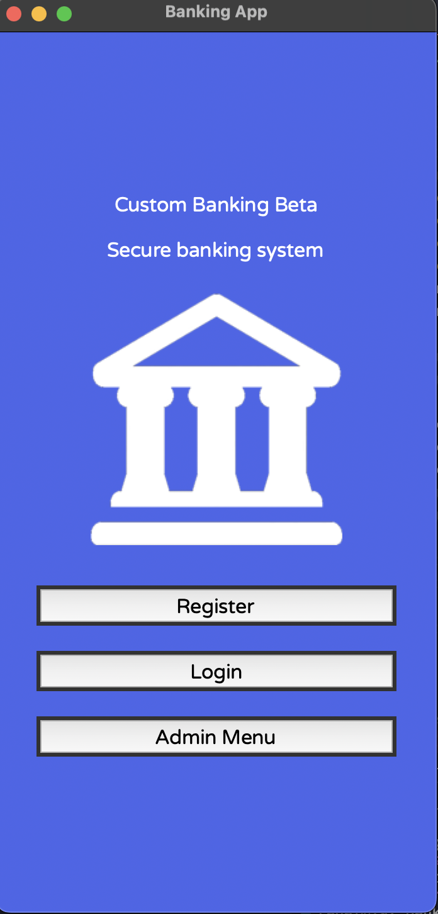

# Banking System Projects

![Python]
![Tkinter]
![OOP]

Two Python implementations of a banking system:
1. **GUI version** (Tkinter)
2. **Console version** (OOP)

## Features

### GUI Banking App
User registration & login  
Deposit/withdraw money  
Transaction history  
Admin panel (view/delete accounts)
Note: Admin password is AdminPassword:) !
Input validation (4-digit PIN)  

### Console Banking System
Account management (create/delete)  
Transaction processing  
Admin mode  
JSON data storage  

##Screenshots

